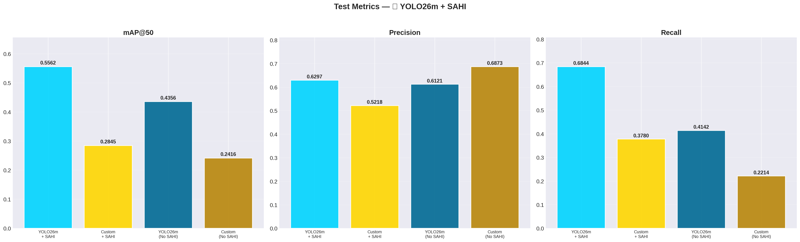
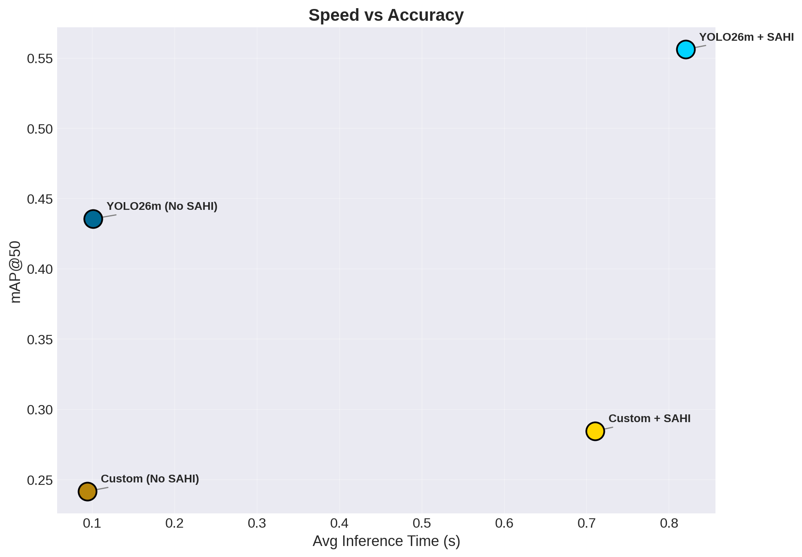
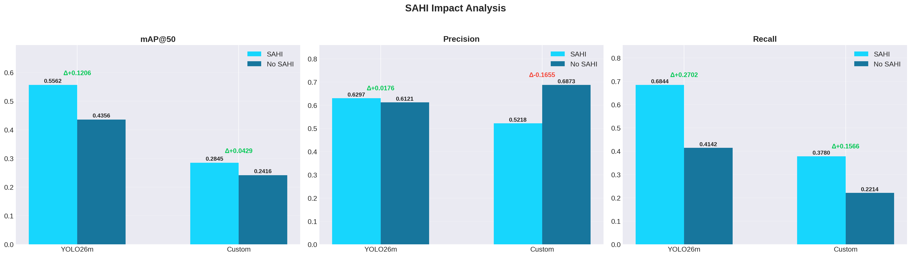
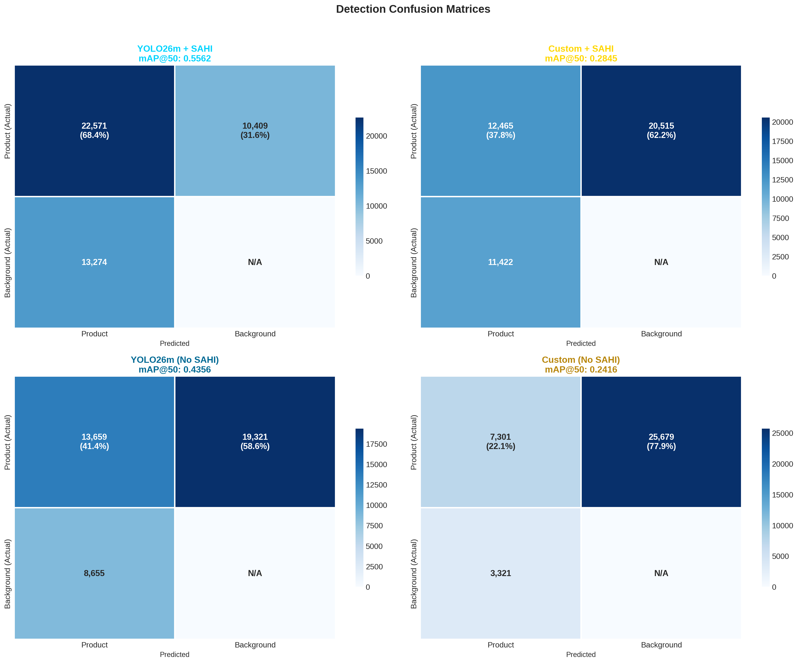
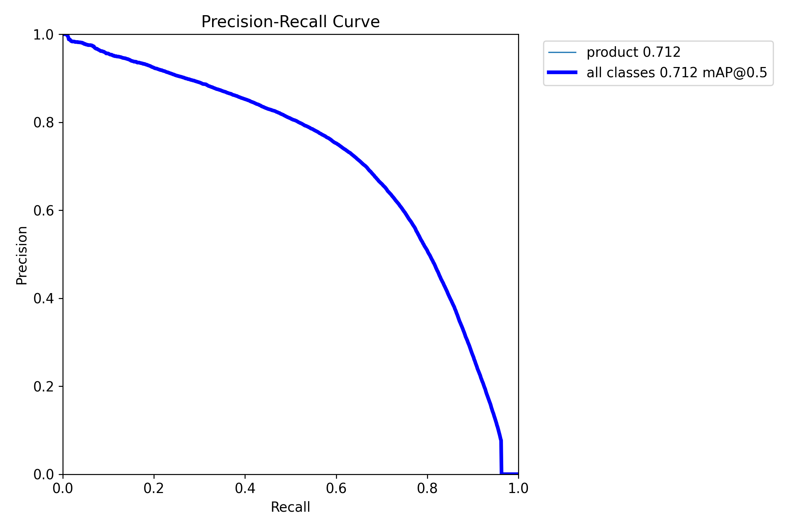
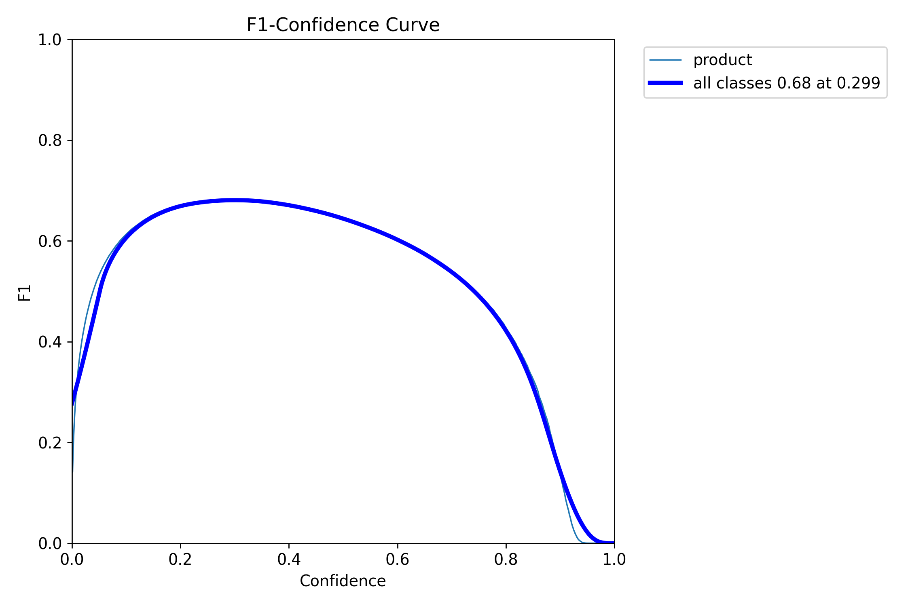
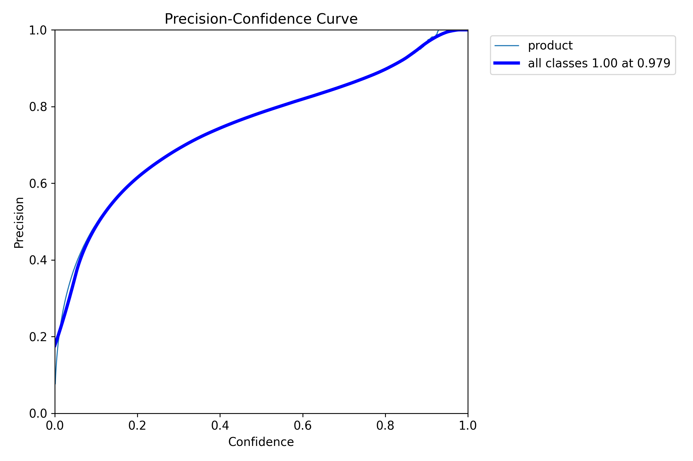
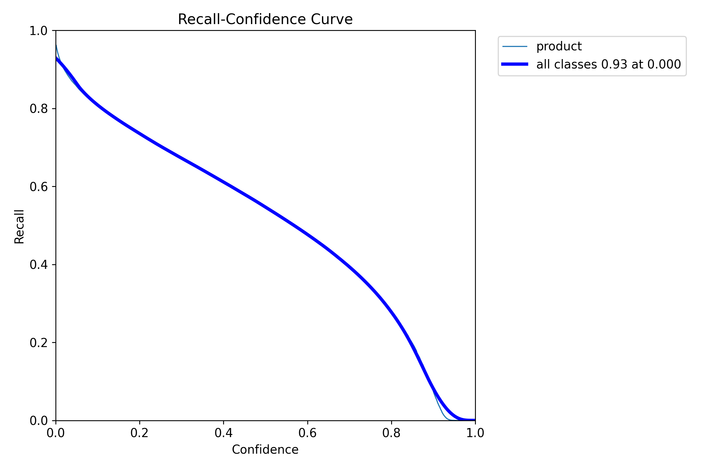
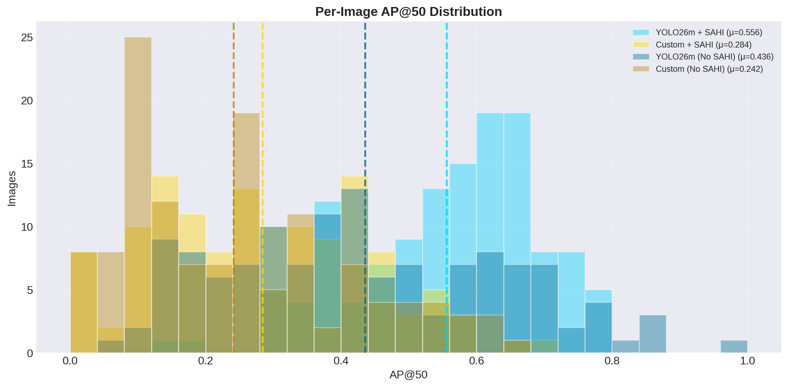

# 📊 Dense Retail Shelf Detection — Test Evaluation Report

> Generated: 2026-06-30 10:53  
> Test Set: 130 images, 32,980 ground-truth objects  
> Image resolution: ~3000×4000 px | Single class: `product`

---

## 1. Test Results Summary

| Variant | mAP@50 | Precision | Recall | TP | FP | FN | Time (s) |
|---------|--------|-----------|--------|------|------|------|----------|
| **YOLO26m + SAHI** 🏆 | 0.5562 | 0.6297 | 0.6844 | 22,571 | 13,274 | 10,409 | 0.820 |
| Custom + SAHI | 0.2845 | 0.5218 | 0.3780 | 12,465 | 11,422 | 20,515 | 0.710 |
| YOLO26m (No SAHI) | 0.4356 | 0.6121 | 0.4142 | 13,659 | 8,655 | 19,321 | 0.101 |
| Custom (No SAHI) | 0.2416 | 0.6873 | 0.2214 | 7,301 | 3,321 | 25,679 | 0.094 |

> 🏆 **Best mAP@50: YOLO26m + SAHI (0.5562)**

---

## 2. Speed vs Accuracy

---

## 3. SAHI Impact Analysis

How much does Slicing Aided Hyper Inference improve detection on full-resolution images?

| Model | SAHI mAP@50 | No-SAHI mAP@50 | Δ mAP@50 | % Change | Δ Prec | Δ Recall |
|-------|-------------|----------------|----------|----------|--------|----------|
| YOLO26m | 0.5562 | 0.4356 | +0.1206 📈 | +27.7% | +0.0176 | +0.2702 |
| Custom | 0.2845 | 0.2416 | +0.0429 📈 | +17.8% | -0.1655 | +0.1566 |

---

## 4. Confusion Matrices

### All Variants

---

## 5. PR Curve & F1 Curve

| PR Curve | F1 Curve |
|----------|----------|
|  |  |

| Precision Curve | Recall Curve |
|-----------------|--------------|
|  |  |

---

## 6. Per-Image AP@50 Distribution

---

## 7. Sample Detections — GT (Left) vs Prediction (Right)

### 7.1 YOLO26m + SAHI

### 7.2 Custom + SAHI

### 7.3 YOLO26m (No SAHI)

### 7.4 Custom (No SAHI)

---

*Report generated by `notebooks/10_generate_report.ipynb`*
